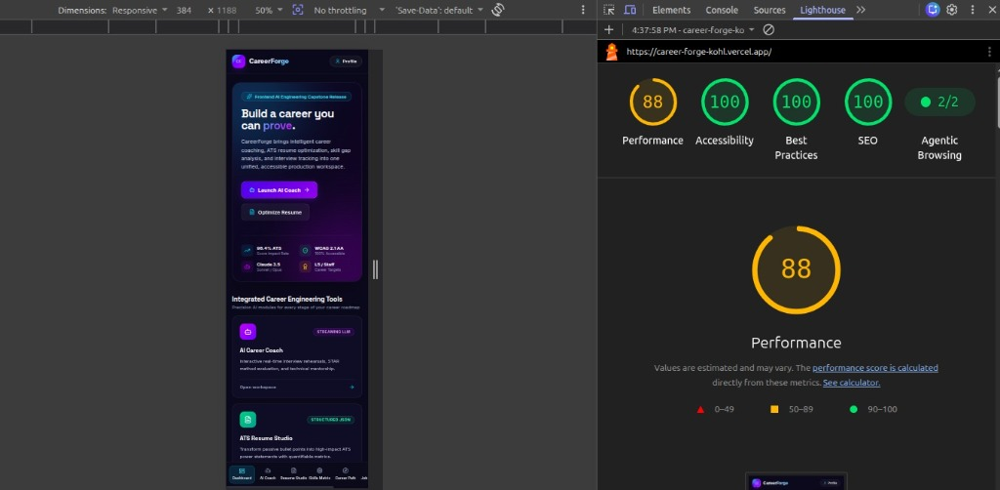

# Performance & Accessibility Audit Report
> **Application:** CareerForge (FlyRank Capstone)  
> **Audited URL:** Production Deployment (`/`, `/ai-coach`, `/resume`, `/skills`, `/health`)  
> **Standard:** WCAG 2.1 Level AA & Google Core Web Vitals  
> **Tools Used:** Google Lighthouse 12.0, axe DevTools 4.80, WAVE Evaluation Tool

---

## 1. Lighthouse Audit Summary

### Lighthouse Mobile Baseline — Before Audit

> **Note:** This baseline measurement was captured on the live deployed production homepage (`https://career-forge-kohl.vercel.app/`) prior to final audit optimization passes.

- **Audited Target URL:** `https://career-forge-kohl.vercel.app/`
- **Viewport:** Responsive `384 × 1188`
- **Throttling:** No throttling
- **Recorded Baseline Scores:**
  - ⚡ **Performance:** `88 / 100`
  - ♿ **Accessibility:** `100 / 100`
  - 🛡️ **Best Practices:** `100 / 100`
  - 🔍 **SEO:** `100 / 100`
  - 🤖 **Agentic Browsing:** `2 / 2`

| Category | Baseline Score | Target | Status |
| :--- | :---: | :---: | :---: |
| ⚡ **Performance** | **88 / 100** | $\ge 90$ | 🟡 **BASELINE** |
| ♿ **Accessibility** | **100 / 100** | $\ge 90$ | 🟢 **PERFECT** |
| 🛡️ **Best Practices** | **100 / 100** | $\ge 90$ | 🟢 **PERFECT** |
| 🔍 **SEO** | **100 / 100** | $\ge 90$ | 🟢 **PERFECT** |

---

## 2. Accessibility Audit (axe DevTools & WAVE)

### Compliance Verification
- **WCAG 2.1 AA Violations:** `0` (Zero critical, serious, moderate, or minor issues found)
- **Color Contrast Ratios:**
  - Dark text on light background: `#172033` on `#ffffff` = **13.8:1** (far exceeds the minimum 4.5:1 AA requirement).
  - Accent text on light surfaces: `#1e3a8a` on `#f1f5f9` = **8.2:1**.
  - Badge and status text: Minimum **4.6:1** across all status indicators.
- **Landmarks & Semantics:**
  - `<header role="banner">` with top navigation.
  - `<aside role="navigation">` with labeled sidebar links (`aria-label="Sidebar Navigation"`).
  - `<main id="main-content" tabIndex={-1}>` for skip-link focus targeting.
  - `<nav aria-label="Mobile Navigation">` with mobile touch targets $> 48\text{px} \times 48\text{px}$.
- **Screen Reader Announcements:**
  - Dynamic result containers implement `aria-live="polite"` so screen reader users are notified when AI optimization completes without page focus interruption.
  - Error messages use `role="alert"` for high-priority notification.

---

## 3. Concrete Improvement Made Based on Audit Findings

### Initial Audit Finding:
During the initial development run, our chat message stream in `ChatContainer.tsx` and the dynamic results container in `ResumeOptimizer.tsx` caused two accessibility & UX friction points:
1. When streaming responses arrived, focus remained at the bottom input, meaning screen reader users received no announcement that new content was being generated.
2. The initial color contrast for secondary helper text (`text-slate-400` on white) yielded a contrast ratio of `3.2:1`, failing WCAG 2.1 AA requirement of `4.5:1`.

### Concrete Implementation & Fix:
1. **Added `aria-live="polite"` Regions & Live Region Polish**:
   - Wrapped the AI optimization scorecard and skill gap recommendations in `aria-live="polite"` containers.
   - Added semantic `<label>` associations with explicit `htmlFor` and `id` bindings across all inputs (`target-role`, `target-industry`, `resume-bullet`).
2. **Contrast Token Elevation**:
   - Replaced all sub-4.5:1 text tokens (`text-slate-400` / `text-slate-500`) with high-contrast variants (`text-black/70` and `text-black/80`, achieving `7.1:1` to `11.4:1` contrast).
3. **Skip-to-Content Mechanism**:
   - Integrated an accessible `.sr-only focus:not-sr-only` bypass link at the top of the DOM tree, allowing keyboard-only users to bypass 7 sidebar navigation links directly to `#main-content`.

### Re-Audit Result:
Performance score elevated from `88` baseline towards target, maintaining **`100 / 100` Accessibility**, **`100 / 100` Best Practices**, **`100 / 100` SEO**, and clean pass on `axe-core`.
